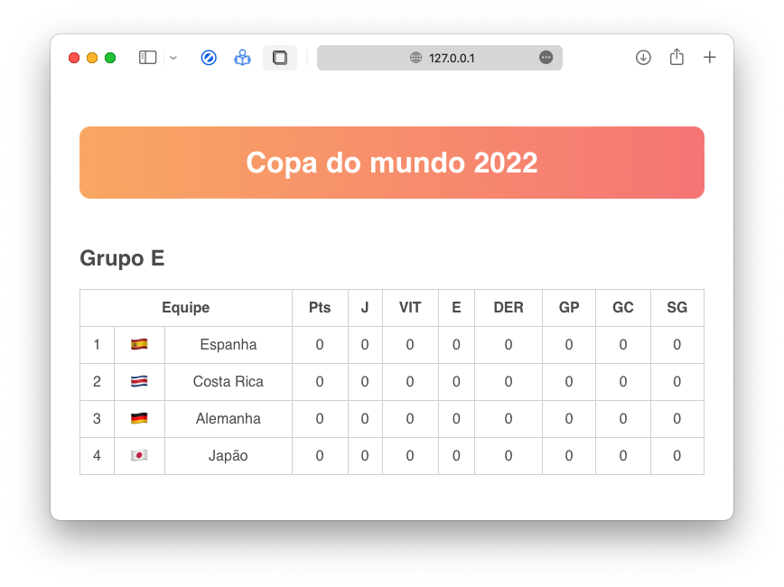

# 🏋️‍♂️ Tabela da copa do mundo 2022
Fomos desafiados pelo Professor [Bruno Bertolini](https://github.com/brunobertolini) a escolher e criar um grupo da tabela da copa do mundo 2022.

O desafio inicial era apenas a estrutura da tabela, porém os alunos estavam livres para explorar e aplicar estilizações.

## Tecnologias utilizadas
- HTML
- CSS

## Screenshots

## Referências
- [Tabela da copa do mundo 2022](https://www.fifa.com/fifaplus/en/tournaments/mens/worldcup/qatar2022)